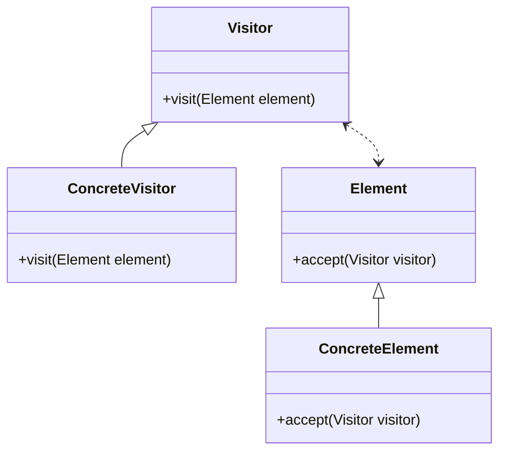

## 핵심 구성요소::key-components

* **Visitor**: 방문하여 처리할 객체의 인터페이스를 정의한다.
* **Element**: 방문자를 받아들이는 객체의 인터페이스를 정의한다.
* **Client**: 적절한 Visitor의 구현을 생성하고, `Element` 객체를 생성하여 `Visitor` 인터페이스를 수락한다.



## 예제::example

비지터 패턴을 살펴보기 전에 이해할 구성 요소간 역할과 책임:

* **Visitor**: 방문하여 처리할 객체의 인터페이스
    * **역할**: 요소에 방문에 대해 처리한다.
    * **책임**: 어떤 요소가 수락했는지 알 수 없기 때문에, 수락을 가정하고 처리를 수행한다.
* **Element**: 방문자를 받아들이는 객체의 인터페이스
    * **역할**: 방문자를 수락한다.
    * **책임**: 방문자를 수락하면, 방문자가 객체를 사용할 수 있도록 제공해야 한다.

### 도형::shape-processing

여러가지의 도형이 존재한다. 이 도형은 `Square`, `Circle`, `Triangle`이 있다.
도형의 넒이를 계산하려면 각 도형에 계산 공식을 정의할 수 도 있다. 하지만, `SVG`로 출력하려는 경우 해당 도형에는 `SVG`를 출력하는 비즈니스 로직을 추가 해야한다.

하지만, 도형 넒이 계산 공식과 `SVG` 출력 로직은 도형과는 관계 없는 행위기 때문에, 비즈니스 구현은 내부에서 이루어질 필요가 없다.

> 이를 이용해 도형의 `넒이`와 `SVG`를 출력하는 기능은 외부에서 Visitor Pattern으로 구현할 수 있다.
:{ "type": "tip", "icon": "lightbulb" }

> 비즈니스 구현에대한 수락은 `Element` 객체가 할 수 있기 때문에, 선택적으로 구현할 수 있다.
:{ "type": "warning", "icon": "warning-diamond" }

**Visitor**

::code-group

```java::방문자
public interface Visitor {
    void visit(Square square);
    void visit(Circle circle);
    void visit(Triangle triangle);
}
```

```java::넓이계산 방문자
public class AreaCalculator implements ShapeVisitor {

    private double total = 0.0;

    public double getTotal() {
        return total;
    }

    @Override
    public void visitSquare(Square square) {
        total += square.getSide() * square.getSide();
    }

    @Override
    public void visitCircle(Circle circle) {
        total += Math.PI * circle.getRadius() * circle.getRadius();
    }

    @Override
    public void visitTriangle(Triangle triangle) {
        total += 0.5 * triangle.getBase() * triangle.getHeight();
    }
}
```

```java::SVG 변환 방문자
public class SVGRenderer implements ShapeVisitor {
    private String svg = "";

    public String getSvg() {
        return svg;
    }

    @Override
    public void visitSquare(Square square) {
        this.svg += String.format("<rect width=\"%d\" height=\"%d\" />", square.getSide(), square.getSide());
    }

    @Override
    public void visitCircle(Circle circle) {
        this.svg += String.format("<circle r=\"%d\" />", circle.getRadius());
    }

    @Override
    public void visitTriangle(Triangle triangle) {
        this.svg += String.format("<polygon points=\"0,0 %d,0 %d, %d\" />", triangle.getBase(), triangle.getBase() /2, triangle.getHeight());
    }
}
```

::

**Element**

::code-group

```java::도형 요소
public interface Shape {
    void accept(Visitor visitor);
}
```

```java::사각형 요소
public class Square implements Shape {

    private final int side;

    public Square(int side) {
        this.side = side;
    }

    public int getSide() {
        return side;
    }

    @Override
    public void accept(ShapeVisitor visitor) {
        visitor.visitSquare(this);
    }
}
```

```java::원 요소
public class Circle implements Shape {

    private final int radius;

    public Circle(int radius) {
        this.radius = radius;
    }

    public int getRadius() {
        return radius;
    }

    @Override
    public void accept(ShapeVisitor visitor) {
        visitor.visitCircle(this);
    }
}
```

```java::삼각형 요소
public class Triangle implements Shape {

    private final int base;
    private final int height;

    public Triangle(int base, int height) {
        this.base = base;
        this.height = height;
    }

    public int getBase() {
        return base;
    }

    public int getHeight() {
        return height;
    }

    @Override
    public void accept(ShapeVisitor visitor) {
        visitor.visitTriangle(this);
    }
}
```

::

**Client**

```java::클라이언트 코드
Shape [] shapes = new Shape[] {
    new Circle(10),
    new Square(20),
    new Triangle(10, 20)
};

AreaCalculator areaCalculator = new AreaCalculator();
SVGRenderer svgRenderer = new SVGRenderer();

for (Shape shape : shapes) {
    shape.accept(areaCalculator);
    shape.accept(svgRenderer);
}

System.out.println("totalArea = " + areaCalculator.getTotal());
System.out.println("svg = " + svgRenderer.getSvg());
```

```text::결과
totalArea = 814.1592653589794
svg = <circle r="10" /><rect width="20" height="20" /><polygon points="0,0 10,0 5, 20" />
```

위 같은 상황으로 처리에 대한 책임을 `Visitor`에게 위임하고, `Element`는 `Visitor`를 수락하여 처리를 수행한다.
또한 아래와 같이 유연하게 흐름을 바꿀수도 있다.

```java::✅ 요소가 수락해도 미처리
@Override
public void visitPentagon(Pentagon pentagon) {
    //다각형은 만들지 않는다.
}
```

```java::✅ 모든 방문자를 수락하지 않거나, 특정 방문자만 수락
@Override
public void accept(ShapeVisitor visitor) {
    if (visitor instanceof SVGRenderer) {
        visitor.visitPentagon(this);   
    }
}
```

> 처리에대한 책임은 `Visitor`에게 있기 때문에, `Vistor`에서 `Element`를 구별하는 것이 좋다.
:{ "type": "tip", "icon": "lightbulb" }

### 파일 시스템::file-system

파일 시스템에는 `파일`과 `디렉토리`가 있다.  
파일의 정보를 출력하려면 각 파일에 대한 정보를 출력하는 비즈니스 로직을 추가 해야한다. 파일 크기를 구하려는 경우 해당 파일에는 파일 크기를 출력하는 비즈니스 로직을 추가 해야한다.

파일 출력과 파일들 크기 계산은 파일과는 관계 없는 행위기 때문에, 비즈니스 구현은 내부에서 이루어질 필요가 없다.

**Visitor**

::code-group

```java::방문자
public interface FileSystemVisitor {
    void visit(File file);
    void visit(Directory directory);
}
```

```java::파일 출력
public class FileListPrinterVisitor implements FileSystemVisitor {

    @Override
    public void visit(File file) {
        System.out.println("File: " + file.getName() + ", Size: " + file.getSize() + " bytes");
    }

    @Override
    public void visit(Directory directory) {
        System.out.println("Directory: " + directory.getName());
        for (var child : directory.getChildren()) {
            child.accept(this);
        }
    }
}
```

```java::파일 크기계산
public class SizeCalculatorVisitor implements FileSystemVisitor {
    private long totalSize = 0;


    @Override
    public void visit(File file) {
        this.totalSize += file.getSize();
    }

    @Override
    public void visit(Directory directory) {
        // 디렉토리 자체의 처리는 필요 없음
        for (var child : directory.getChildren()) {
            child.accept(this);
        }
    }

    public long getTotalSize() {
        return this.totalSize;
    }
}
```

::

> 도형 예제와 다르게 `visit` 메서드를 오버로딩 하였다. 이는 오버로딩이 제공되는 언어에서는 다형성을 이용하여 처리할 수 있다.
:{ "type": "tip", "icon": "lightbulb" }

**Element**

::code-group

```java::요소
public interface FileSystemElement {
    void accept(FileSystemVisitor visitor);
}
```

```java::파일
public class File implements FileSystemElement {

    private final String name;
    private final long size;

    public File(String name, long size) {
        this.name = name;
        this.size = size;
    }

    public String getName() {
        return name;
    }

    public long getSize() {
        return this.size;
    }

    @Override
    public void accept(FileSystemVisitor visitor) {
        visitor.visit(this);
    }
}
```

```java::디렉토리
public class Directory implements FileSystemElement {
    private final String name;
    private final List<FileSystemElement> children = new ArrayList<>();

    public Directory(String name) {
        this.name = name;
    }

    public String getName() {
        return name;
    }

    public void addChild(FileSystemElement child) {
        children.add(child);
    }

    public List<FileSystemElement> getChildren() {
        return children;
    }

    @Override
    public void accept(FileSystemVisitor visitor) {
        visitor.visit(this);
    }
}
```

::

**Client**

```java::클라이언트 코드
// 파일 시스템 구조 생성
Directory root = new Directory("root");
Directory documents = new Directory("documents");
Directory pictures = new Directory("pictures");

root.addChild(documents);
root.addChild(pictures);

documents.addChild(new File("visitor-pattern.md", 42366));
documents.addChild(new File("composite-pattern.md", 32456));

pictures.addChild(new File("visitor-pattern-intro.png", 83456));
pictures.addChild(new File("visitor-pattern-diagram.svg", 23456));

//크기 계산 Visitor 사용
SizeCalculatorVisitor sizeVisitor = new SizeCalculatorVisitor();
root.accept(sizeVisitor);
System.out.println("Total Size: " + sizeVisitor.getTotalSize() + " bytes");

// 파일 목록 출력 Visitor 사용
FileListPrinterVisitor printerVisitor = new FileListPrinterVisitor();
root.accept(printerVisitor);
```

```text::결과
Total Size: 181734 bytes
Directory: root
Directory: documents
File: visitor-pattern.md, Size: 42366 bytes
File: composite-pattern.md, Size: 32456 bytes
Directory: pictures
File: visitor-pattern-intro.png, Size: 83456 bytes
File: visitor-pattern-diagram.svg, Size: 23456 bytes
```

## 적용::applicability

`Visitor` 패턴은 다음과 같은 경우에 사용할 수 있다.

* 객체들을 순회하며, 다양한 작업을 수행해야 하는 경우
* 객체의 구조와 작업을 분리하고 싶은 경우

## 장단점::pros-and-cons

**장점**

* [개방/폐쇄 원칙](): 다른 클래스를 변경하지 않으면서 해당 클래스의 객체와 작동할 수 있는 새로운 처리를 추가할 수 있다.
* [단일 책임 원칙](): 같은 행동의 여러 버전을 같은 클래스로 나눌 수 있다.
* 비지터 객체는 다양한 객체들과 작업하면서 유용한 정보를 축적할 수 있다. 이것은 객체 트리와 같은 복잡한 객체 구조를 순회하여 이 구조의 각 객체에 비지터 패턴을 적용하려는 경우에 유용하다.

**단점**

* 클래스가 요소 계층구조에 추가되거나 제거될 때마다 모든 비지터를 업데이트해야 한다.
* 비지터들은 함께 작업해야 하는 요소들의 비공개 필드들 및 메서드들에 제한적인 기능에 대해 확장이 필요할 수 있다.
