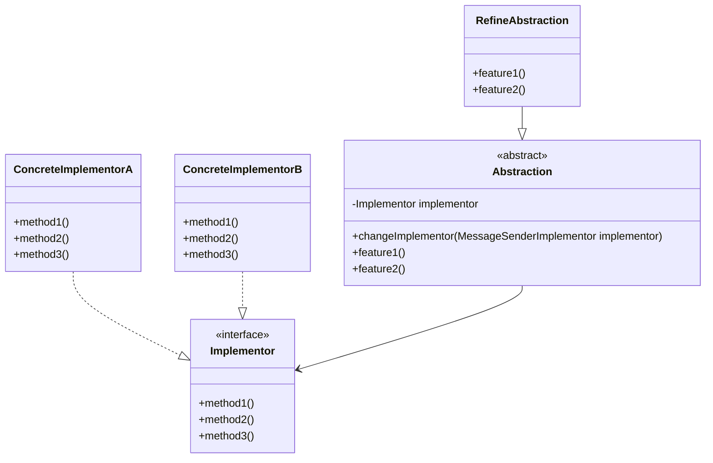

# Bridge Pattern

브릿지 패턴은 구현부와 추상부를 분리하여 각각 독립적으로 변형할 수 있도록 하는 패턴이다. 
각각의 독립된 클래스로 구성하여 서로 연결하여 사용할 수 있도록 한다.

## 핵심 구성요소::key-components

- Abstraction: 기능의 구현을 위한 인터페이스를 정의한다.
- RefinedAbstraction: Abstraction 인터페이스를 구현하여 기능을 확장한다.
- Implementor: 실제 동작의 구현부를 정의한다.
- ConcreteImplementor: Implementor 인터페이스를 구현하여 실제 동작을 수행한다.
- Client: Bridge 패턴을 사용하는 클래스이다.

먼저 Bridge 패턴을 사용하기 위해 선언한 핵심 구성요소는 아래와 같은 관계로 구성된다.



각각의 구현부(Implementor)와 추상부(Abstraction)라는 Bridge 통해 연결되어 사용자에게 제공 된다.  
위의 다이어그램을 보면 추상부를 추가하고 싶다면 정제된 추상부(RefineAbstraction)를 추가하여 구현하면 되며, 구현부를 추가하고 싶다면, 실제 구현부(ConcreteImplementor)를 추가하여 구현하면 된다.

## 예제::example

`Bridge Pattern`을 알아보기 위해 다음과 같은 예제를 살펴보자. 

### 멀티 미디어 플레이어::-player-example

예를 들어 다양한 장치의 미디어 플레이어를 구현하려 한다.
또한 각각의 장치에서는 미디어 플레이어의 기능을 확장하여 동영상 플레이어와 음악 플레이어를 구현하려 한다.

이들 간에 공통적인 기능을 추상화하여 구현하고, 각각의 플레이어들은 이를 구현하여 사용한다.


**Implementor**

Implementor: 공통적인 기능을 추상화하여 구현한다.

::code-group

```java::PlayerImplementor.java
public interface PlayerImplementor {

    //파일명을 받아 플레이 한다.
    void playFile(String filename);

    //일시정지
    void stopPlayback();

    //코덱을 로드한다.
    void loadCodec(String codec);
}
```

```java::WindowsPlayer.java
public class WindowsPlayer implements PlayerImplementor {

    @Override
    public void playFile(String filename) {
        loadCodec("Windows DirectShow");
        System.out.println("Playing " + filename + " using Windows media player");
    }

    @Override
    public void stopPlayback() {
        System.out.println("Stopping playback on Windows");
    }

    @Override
    public void loadCodec(String codec) {
        System.out.println("Loading " + codec + " codec on Windows");
    }
}
```

```java::MacPlayer.java
public class MacPlayer implements PlayerImplementor {
    @Override
    public void playFile(String filename) {
        loadCodec("Apple QuickTime");
        System.out.println("Playing "+ filename + " using QuickTime Player");
    }

    @Override
    public void stopPlayback() {
        System.out.println("Stopping playback on MacOS");
    }

    @Override
    public void loadCodec(String codec) {
        System.out.println("Loading " + codec + " codec on MacOS");
    }
}
```

::

**Abstraction**

Abstraction: Implementor 인터페이스를 참조하여 기능을 확장한다.

::code-group

```java::MediaPlayer.java
public abstract class MediaPlayer {

    protected PlayerImplementor implementor;

    public MediaPlayer(PlayerImplementor implementor) {
        this.implementor = implementor;
    }

    public abstract void play(String filename);
    public abstract void stop();
}
```

```java::VideoPlayer.java
public class VideoPlayer extends MediaPlayer {

    public VideoPlayer(PlayerImplementor implementor) {
        super(implementor);
    }

    @Override
    public void play(String filename) {
        System.out.println("Video Player:");
        implementor.playFile(filename);
    }

    @Override
    public void stop() {
        System.out.println("Video Player:");
        implementor.stopPlayback();
    }
}
```

```java::MusicPlayer.java
public class MusicPlayer extends MediaPlayer {

    public MusicPlayer(PlayerImplementor implementor) {
        super(implementor);
    }

    @Override
    public void play(String filename) {
        System.out.println("Music Player:");
        implementor.playFile(filename);
    }

    @Override
    public void stop() {
        System.out.println("Music Player:");
        implementor.stopPlayback();
    }
}
```

::


**Client**

클라이언트에서는 실제로 각각의 독립된 컴포넌트를 이용해, 다양한 기능으로 확장하여 사용할 수 있다.

::code-group

```java::MacOS의 음악 플레이어 예제
PlayerImplementor macPlayer = new MacPlayer();
MediaPlayer macMusicPlayer = new MusicPlayer(macPlayer);

macMusicPlayer.play("music.mp3");
macMusicPlayer.stop();
```

```java::Windows의 동영상 플레이어 예제
PlayerImplementor windowsPlayer = new WindowsPlayer();
MediaPlayer windowsVideoPlayer = new VideoPlayer(windowsPlayer);

windowsVideoPlayer.play("video.mp4");
windowsVideoPlayer.stop();
```

::


### 추가적인 요구사항::additional-requirements

위의 기능이 경우 추상부와 구현부는 명백하게 독립적으로 동작한다.
만약 현재의 상황에서 AppPlayer 가 추가된다면 어떨까? BlueStack 앱에 대해 확장할 수있는 코드를 아래와 같이 추가할 수있다.


::code-group

```java::AndroidAppPlayer.java
public abstract class AndroidAppPlayer extends MediaPlayer {

    public AndroidAppPlayer(PlayerImplementor implementor) {
        super(implementor);
    }
    
    protected void emulateVirtualMachine() {
        System.out.println("Emulating Android Virtual Machine");
    }
}
```

```java::BlueStackAppPlayer.java
public class BlueStackAppPlayer extends AndroidAppPlayer {

    public BlueStackAppPlayer(PlayerImplementor implementor) {
        super(implementor);
    }

    @Override
    public void play(String filename) {
        super.emulateVirtualMachine();
        System.out.println("App Player:");
        implementor.playFile(filename);
    }

    @Override
    public void stop() {
        System.out.println("App Player:");
        implementor.stopPlayback();
    }
}
```

```java::Windows의 BlueStack 앱 플레이어 예제

PlayerImplementor windowsPlayer = new WindowsPlayer();
MediaPlayer windowsBlueStackPlayer = new BlueStackAppPlayer(windowsPlayer);

windowsBlueStackPlayer.play("app.apk");
windowsBlueStackPlayer.stop();
```

::

### 메세지 발송 시스템:: message-sender-example

공통 구현부로는 메세징 플랫폼이 존재한다.
이 구현부를 확장하여 메세지 전송에 대한 추상적인 부분을 확장한다.

**Implementor**

구현부로서 다음의 기능을 공통화한다.

1. 실제 메세지 전송
2. 수신인 검증
3. 메세지 설정 세팅

::code-group

```java::MessageSenderImplementor.java
public interface MessageSenderImplementor {

    void sendMessage(String message, String recipient);
    boolean validateRecipient(String recipient);
    void configureSettings(Map<String, String> settings);
}
```

```java::EmailPlatform.java
public class EmailPlatform implements MessageSenderImplementor {

    @Override
    public void sendMessage(String message, String recipient) {
        if (validateRecipient(recipient)) {
            System.out.println("Sending email to " + recipient);
            System.out.println("Email content: " + message);
        }
    }

    @Override
    public boolean validateRecipient(String recipient) {
        return recipient.matches("^[A-Za-z0-9+_.-]+@(.+)$");
    }

    @Override
    public void configureSettings(Map<String, String> settings) {
        System.out.println("Configuring email settings: " + settings);
    }
}
```

```java::SMSPlatform.java
public class SMSPlatform implements MessageSenderImplementor {

    @Override
    public void sendMessage(String message, String recipient) {
        if (validateRecipient(recipient)) {
            System.out.println("Sending SMS to " + recipient);
            System.out.println("SMS content: " + message);
        }
    }

    @Override
    public boolean validateRecipient(String recipient) {
        return recipient.matches("^\\d{10}$");
    }

    @Override
    public void configureSettings(Map<String, String> settings) {
        System.out.println("Configuring SMS settings: " + settings);
    }
}
```

::

**Abstraction**

추상부로서 구현부의 기능을 확장하여 긴급 메세지, 일반 메세지 등을 처리할 수 있는 메세지 전송자를 구현한다.


::code-group

```java::MessageSender.java
public abstract class MessageSender {
    protected MessageSenderImplementor implementor;

    protected MessageSender(MessageSenderImplementor implementor) {
        this.implementor = implementor;
    }

    protected void changeImplementor(MessageSenderImplementor implementor) {
        this.implementor = implementor;
    }

    public abstract void send(String message, String recipient);
}
```

```java::UrgentMessageSender.java
public class UrgentMessageSender extends MessageSender {

    public UrgentMessageSender(MessageSenderImplementor implementor) {
        super(implementor);
    }

    @Override
    public void send(String message, String recipient) {
        message = "[URGENT] " + message;
        implementor.sendMessage(message, recipient);
    }
}
```

```java::RegalarMessageSender.java
public class RegularMessageSender extends MessageSender {

    public RegularMessageSender(MessageSenderImplementor implementor) {
        super(implementor);
    }

    @Override
    public void send(String message, String recipient) {
        implementor.sendMessage(message, recipient);
    }
}
```

::

**Client**

클라이언트에서는 실제로 각각의 독립된 컴포넌트를 이용해, 다양한 기능으로 확장하여 사용할 수 있다.

```java::메세지 발송 예제
Map<String, String> emailSettings = new HashMap<>();
emailSettings.put("smtp", "smtp.gmail.com");
emailSettings.put("port", "587");

Map<String, String> smsSettings = new HashMap<>();
smsSettings.put("api_key", "your_api_key");
smsSettings.put("provider", "twilio");


MessageSenderImplementor emailPlatform = new EmailPlatform();
MessageSenderImplementor smsPlatform = new EmailPlatform();

emailPlatform.configureSettings(emailSettings);
smsPlatform.configureSettings(smsSettings);

MessageSender urgentEmailSender = new UrgentMessageSender(emailPlatform);
MessageSender regularSMSSender = new RegularMessageSender(smsPlatform);

urgentEmailSender.send("Server is down!", "admin@company.com");
regularSMSSender.send("Hello, how are you?", "+1234567890");
```

## 적용::applicability

> 브릿지 패턴은 여러 변형을 가진 모놀리식 클래스를 분리하여 각각의 독립적인 클래스로 나누고 다양한 확장 기능을 구조화하여 연결하기 위해 사용한다.
:{ "type": "tip", "icon": "lightbulb" }

어떤 기능 정의하는 클래스가 거대해질 수록 작동 방식이 복잡해지고, 유지보수 및 확장이 어려워진다.
한곳에 있는 코드는 다른 코드에 영향을 미치기 쉽기 때문에, 이를 분리하여 독립적으로 관리할 수 있도록 하는것이 좋다.

브릿지 패턴을 사용하면, 모놀리식 클래스를 여러 클래스 계층구조로 나눌수있다. 그런 다음 각 계층구조의 클래스들을 다른 계층구조들에 있는 클래스들과는 독립적으로 변경할 수 있다.
이 접근 방식은 코드의 유지관리를 단순화하고 기존코 드가 손상될 위험을 최소화한다.


## 장단점::pros-and-cons

**장점**

* 플랫폼 독립적인 클래스들과 앱들을 만들 수 있다.
* 클라이언트 코드는 상위 수준의 추상화를 통해 작동하며, 플랫폼 세부 정보에 노출 되지 않는다.
* [개방/폐쇄 원칙](). 새로운 추상화 들과 구현들을 상호 독립적으로 도입할 수 있다.
* [단일 책임 원칙](). 추상화의 상위수준 논리와 구현의 플랫폼 세부 정보에 집중할 수 있다.

**단점**

* 결합도가 높은 클래스에 패턴을 적용하면 코드를 더 복잡하게 만들 수 있다.