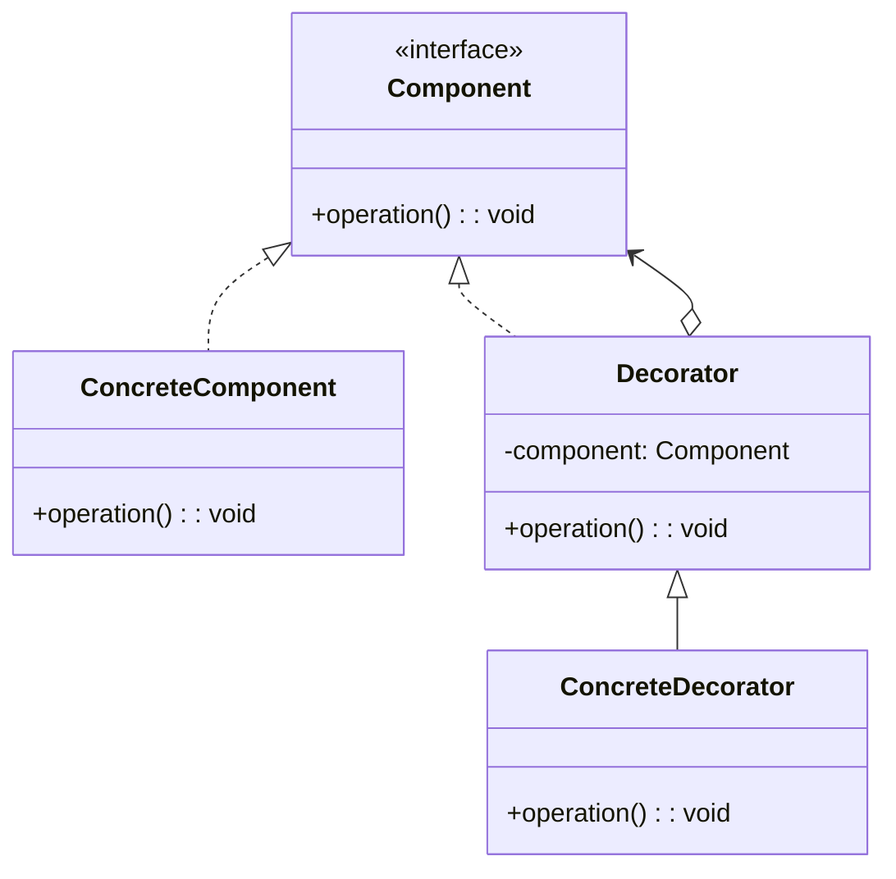

## 핵심 구성요소::key-components

* **Component**: 기준이 되는 기본기능을 나타내는 **인터페이스**
* **ConcreteComponent**: 기준이 되는 기본 구상 클래스
* **Decorator**: 다양한 기능으로 꾸미기 위해 기본객체를 `Wrapping`하는 클래스
* **ConcreteDecorator**: 실제 확장을 담당하는 데코레이터

`데코레이터 패턴(이하 데코레이터)`는 [프록시 패턴]()과 유사하다. 구현의 개념과, 참조의 개념도 포함되어 있다.



## 예제::example

데코레이터 패턴을 살펴보기 전에 이해할 구성 요소간 역할과 책임:

* **Component**
    * **역할**: 기본 행위를 나타낸다.
    * **책임**: 기본 행위를 구현하기 위해 필요한 기능들을 인터페이스한다.
* **ConcreteComponent**
    * **역할**: 실제 기본 행위의 기준이다.
    * **책임**: 기본 역할에 대한 필요한 기능을 구현하며, 이를 수행한다.
* **Decorator**
    * **역할**: 여러 데코레이터에서 사용할 수 있도록 기본 객체를 래핑한다.
    * **책임**: 공통적인 추가기능을 수행하며, 확장 객체가 올바르게 수행될수 있도록 기본 행위를 처리한다.
* **ConcreteDecorator**
    * **역할**: 실제 확장을 담당한다.
    * **책임**: 래핑 객체에 대한 실제 확장기능을 수행하며, 기본 기능은 래핑 객체에 위임한다.

### 다양한 커피 만들기::make-various-coffee

커피를 만드려한다. 여러가지 커피와, 토핑을 추가하기 위해 토핑을 정의하고, 기본 커피에 추가하여 새로운 커피를 만들자.

**Component**

::code-group

```java::커피
// Component
public interface Coffee {
    double getCost();
    String getDescription();

    default void print() {
        System.out.printf("주문: %s\n가격: %.2f원\n", getDescription(), getCost());
    }
}
```

```java::에스프레소
// ConcreteComponent
public class Espresso implements Coffee {

    @Override
    public double getCost() {
        return 1500;
    }

    @Override
    public String getDescription() {
        return "에스프레소";
    }
}
```

```java::아메리카노
// ConcreteComponent
public class Americano implements Coffee {

    private final Espresso espresso;

    public Americano(Espresso espresso) {
        this.espresso = espresso;
    }

    @Override
    public double getCost() {
        return espresso.getCost() + 500;
    }

    @Override
    public String getDescription() {
        return "아메리카노";
    }
```

::

**Decorator**

::code-group

```java::토핑
// Decorator
public class CoffeeDecorator implements Coffee {

    protected final Coffee decoratedCoffee;

    public CoffeeDecorator(Coffee decoratedCoffee) {
        this.decoratedCoffee = decoratedCoffee;
    }

    @Override
    public double getCost() {
        return this.decoratedCoffee.getCost();
    }

    @Override
    public String getDescription() {
        return this.decoratedCoffee.getDescription();
    }
}
```

```java::추가 샷
public class ExtraShot extends CoffeeDecorator {

    public ExtraShot(Coffee decoratedCoffee) {
        super(decoratedCoffee);
    }

    @Override
    public double getCost() {
        return super.getCost() + 1500;
    }

    @Override
    public String getDescription() {
        return super.getDescription() + ", 샷 추가";
    }
}
```

```java::바닐라 시럽
public class Vanilla extends io.alloc.structure.decorator.coffee.decorator.CoffeeDecorator {

    public Vanilla(Coffee decoratedCoffee) {
        super(decoratedCoffee);
    }

    @Override
    public double getCost() {
        return super.getCost() + 1000;
    }

    @Override
    public String getDescription() {
        return super.getDescription() + ", 바닐라 시럽";
    }
}
```

```java::휘핑 크림
public class WhippedCream extends io.alloc.structure.decorator.coffee.decorator.CoffeeDecorator {

    public WhippedCream(Coffee decoratedCoffee) {
        super(decoratedCoffee);
    }

    @Override
    public double getCost() {
        return super.getCost() + 800;
    }

    @Override
    public String getDescription() {
        return super.getDescription() + ", 휘핑 크림";
    }
}
```

::

```java::클라이언트 코드
Espresso espresso = new Espresso();

// 아메리카노
Coffee americano = new Americano(espresso);
americano.print();

// 샷이 추가된 아메리카노 주문
Coffee doubleShot = new ExtraShot(americano);
doubleShot.print();

//트리플샷
Coffee tripleShot = new ExtraShot(doubleShot);
tripleShot.print();

//바닐라 시럽, 휘핑크림이 추가된  아메리카노 주문
Vanilla vanillaAdded = new Vanilla(americano);
Coffee whippedVanillaAmericano = new WhippedCream(vanillaAdded);
whippedVanillaAmericano.print();
```

클라이언트는 필요한 확장 기능을 사용하여, 유연하게 최종 기능을 구현할 수 있으며, 원본에대한 불변성까지 보장할 수 있다.

> 지속적인 확장을 위해 원본을 재사용할 수 도 있다.
:{ "type": "tip", "icon": "lightbulb" }

```text::결과
주문: 아메리카노
가격: 2000.00원
주문: 아메리카노, 샷 추가
가격: 3500.00원
주문: 아메리카노, 샷 추가, 샷 추가
가격: 5000.00원
주문: 아메리카노, 바닐라 시럽, 휘핑 크림
가격: 3800.00원
```

## 적용::applicability

`데코레이터`는 다음과 같은 상황에서 적용 가능하다.

* 원본의 코드를 훼손하지 않으면서 런타임에 유연한 확장이 필요한 경우
* 상속으로의 확장이 불가능 하거나 어색한 경우

## 장단점::pros-and-cons

**장점**

* [단일 책임 원칙](): 다양한 기능을 분리하여, 각각의 클래스가 하나의 책임을 갖도록 한다.
* 새로운 자식클래스를 만들지 않고도, 기존 클래스의 기능을 확장할 수 있다.
* 런타임에 객체들의 책임을 추가하거나, 제거 가능하다.

**단점**

* 래퍼들의 스택에서 특정 래퍼를 제거하기가 어렵다. (중간만 빼려면 다시 만들어야 한다.)
* 데코레이터의 행동이 스택내의 순서에 의존하지 않는 방식으로 구현하기가 어렵다.
    * 즉 데코레이터의 순서가 중요한 경우, 데코레이터의 순서를 보장하기 어렵다.
